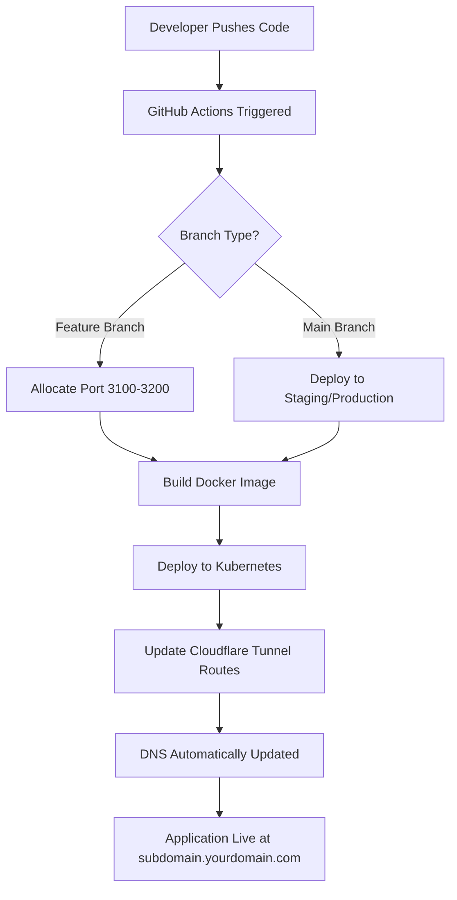

# Cloudflare and GitHub CI/CD Setup Guide

This guide explains how to configure **Cloudflare Tunnel** and **GitHub Actions** for automated deployments of your Next.js application to a Kubernetes cluster.

## 📚 Table of Contents

- [Overview](#-overview)
- [What is Cloudflare Tunnel?](#-what-is-cloudflare-tunnel)
- [Architecture](#-architecture)
- [Prerequisites](#-prerequisites)
- [Part 1: Cloudflare Configuration](#-part-1-cloudflare-configuration)
- [Part 2: Kubernetes Service Account Setup](#-part-2-kubernetes-service-account-setup)
- [Part 3: GitHub Repository Configuration](#-part-3-github-repository-configuration)
- [Part 4: GitHub Environments (Optional)](#-part-4-github-environments-optional)
- [Part 5: Verification](#-part-5-verification)
- [Troubleshooting](#-troubleshooting)
- [Security Best Practices](#-security-best-practices)
- [Additional Resources](#-additional-resources)

---

## 🎯 Overview

This setup enables:

- ✅ **Automatic deployments** from GitHub to Kubernetes
- ✅ **Feature branch previews** with unique URLs (e.g., `xyz-dev.yourdomain.com`)
- ✅ **Secure tunnel** connections without exposing your Kubernetes cluster directly
- ✅ **Dynamic port allocation** for concurrent deployments
- ✅ **DNS automation** via Cloudflare API

---

## 🌐 What is Cloudflare Tunnel?

**Cloudflare Tunnel** (formerly Argo Tunnel) creates a secure, outbound-only connection from your infrastructure to Cloudflare's network without opening inbound ports.

### How It Works

```
┌─────────────────┐         ┌──────────────────┐         ┌─────────────────┐
│   User Browser  │────────▶│  Cloudflare Edge │────────▶│  Your Server    │
│                 │  HTTPS  │   (DNS Proxy)    │  Tunnel │  (K8s Cluster)  │
└─────────────────┘         └──────────────────┘         └─────────────────┘
                                      │                            │
                                      │    No inbound ports!       │
                                      │    Outbound connection     │
                                      └────────────────────────────┘
```

### Key Benefits

1. **No Firewall Configuration Required** - No need to open ports 80/443
2. **DDoS Protection** - Cloudflare absorbs attacks before reaching your server
3. **Built-in SSL/TLS** - Automatic HTTPS certificates
4. **Zero Trust Security** - Add authentication policies if needed
5. **Dynamic Routing** - Update routes via API without server changes

**Learn More:**

- [Cloudflare Tunnel Documentation](https://developers.cloudflare.com/cloudflare-one/connections/connect-networks/)
- [How Cloudflare Tunnel Works](https://blog.cloudflare.com/tunnel-for-everyone/)

---

## 🏗️ Architecture

### Deployment Flow

```
┌──────────────────────────────────────────────────────────────────────────┐
│                            GitHub Actions Workflow                       │
│                                                                          │
│  1. Code Push ──▶ 2. Build & Test ──▶ 3. Build Docker ──▶ 4. Deploy K8s  │
└────────────────────────────────────┬─────────────────────────────────────┘
                                     │
                                     ▼
┌──────────────────────────────────────────────────────────────────────────┐
│                           Kubernetes Cluster (K3s)                       │
│                                                                          │
│     ┌─────────────────┐   ┌─────────────────┐   ┌─────────────────┐      │
│     │ Feature Branch  │   │ Feature Branch  │   │ Feature Branch  │      │
│     │   Namespace A   │   │   Namespace B   │   │   Namespace C   │      │
│     │  Port: 31000    │   │  Port: 31001    │   │  Port: 31002    │      │
│     └────────┬────────┘   └────────┬────────┘   └────────┬────────┘      │
│              │                     │                     │               │
│              └─────────────────────┴─────────────────────┘               │
│                                    │                                     │
└────────────────────────────────────┼─────────────────────────────────────┘
                                     │
                                     ▼
                        ┌──────────────────────────┐
                        │   Cloudflare Tunnel      │
                        │   (cloudflared daemon)   │
                        └────────────┬─────────────┘
                                     │
                                     ▼
                    ┌─────────────────────────────────────┐
                    │          Cloudflare Network         │
                    │                                     │
                    │  Routes:                            │
                    │  feature-a.domain.com ─▶ Port 3100  │
                    │  feature-b.domain.com ─▶ Port 3101  │
                    │  feature-c.domain.com ─▶ Port 3102  │
                    └─────────────────────────────────────┘
```

### CI/CD Pipeline Flow



---

## 📋 Prerequisites

Before starting, ensure you have:

- ✅ **Cloudflare Account** - [Sign up here](https://dash.cloudflare.com/sign-up)
- ✅ **Domain with Cloudflare DNS** - Your domain's nameservers must point to Cloudflare
  - [How to add a domain to Cloudflare](https://developers.cloudflare.com/fundamentals/setup/account-setup/add-site/)
- ✅ **GitHub Repository** - For your Next.js application
- ✅ **Kubernetes Cluster Access** - K3s or any Kubernetes cluster with `kubectl` configured
- ✅ **SSH Access to Server** - To install and configure Cloudflare Tunnel daemon

---

## 🔷 Part 1: Cloudflare Configuration

### Step 1: Create Cloudflare Tunnel

A tunnel creates a persistent connection between your server and Cloudflare.

#### Option A: Via Cloudflare Dashboard (Recommended)

1. Log in to [Cloudflare Zero Trust Dashboard](https://one.dash.cloudflare.com/)
2. Navigate to **Networks** → **Tunnels**
3. Click **Create a tunnel**
4. Select **Cloudflared** as the connector type
5. Name your tunnel (e.g., `nextjs-deployment`)
6. Click **Save tunnel**
7. **Important:** Copy and save the **Tunnel ID**
   - Found in the URL: `https://one.dash.cloudflare.com/.../tunnels/<TUNNEL_ID>`
   - Or in tunnel details page

**Note:** Don't configure routes yet - the CI/CD pipeline will manage routes automatically.

#### Option B: Via CLI

```bash
# Install cloudflared
curl -L https://github.com/cloudflare/cloudflared/releases/latest/download/cloudflared-linux-amd64 -o /usr/local/bin/cloudflared
chmod +x /usr/local/bin/cloudflared

# Authenticate
cloudflared tunnel login

# Create tunnel
cloudflared tunnel create nextjs-deployment

# List tunnels to get ID
cloudflared tunnel list
```

**Learn More:**

- [Cloudflare Tunnel Setup Guide](https://developers.cloudflare.com/cloudflare-one/connections/connect-networks/get-started/create-remote-tunnel/)

---

### Step 2: Get Cloudflare API Token

The API token allows GitHub Actions to update tunnel routes programmatically.

1. Go to [Cloudflare API Tokens](https://dash.cloudflare.com/profile/api-tokens)
2. Click **Create Token**
3. Select **Edit Cloudflare Zero Trust** template OR create custom token:

   **Permissions Required:**

   ```
   Account → Cloudflare Tunnel → Edit
   Zone    → DNS               → Edit
   ```

4. **Account Resources:**
   - Include → Your Account

5. **Zone Resources:**
   - Include → Your specific domain (e.g., `yourdomain.com`)

6. Click **Continue to summary** → **Create Token**
7. **Copy the token immediately** - You won't be able to see it again!

⚠️ **Security Note:** This token grants significant permissions. Store it securely in GitHub Secrets (next section).

**Learn More:**

- [Creating API Tokens](https://developers.cloudflare.com/fundamentals/api/get-started/create-token/)
- [API Token Permissions](https://developers.cloudflare.com/fundamentals/api/reference/permissions/)

---

### Step 3: Get Cloudflare Account ID

1. Go to [Cloudflare Dashboard](https://dash.cloudflare.com)
2. Select any domain
3. Scroll down the right sidebar to find **Account ID**
   - Alternatively, check the URL: `dash.cloudflare.com/{account-id}/`
4. Copy the Account ID (format: `a1b2c3d4e5f6g7h8i9j0k1l2m3n4o5p6`)

---

### Step 4: Install Cloudflare Tunnel Daemon on Your Server

SSH into your Kubernetes server and install the tunnel connector.

#### Install cloudflared

```bash
# Download cloudflared
curl -L https://github.com/cloudflare/cloudflared/releases/latest/download/cloudflared-linux-amd64 -o /usr/local/bin/cloudflared
chmod +x /usr/local/bin/cloudflared

# Verify installation
cloudflared --version
```

#### Get Tunnel Installation Token

1. Return to [Cloudflare Zero Trust Dashboard](https://one.dash.cloudflare.com/)
2. Navigate to **Networks** → **Tunnels**
3. Click on your tunnel name
4. Click **Configure**
5. Under "Install and run a connector", you'll see a command like:

   ```bash
   sudo cloudflared service install eyJhIjoiY...
   ```

6. Copy the **token portion** (long string after `install`)

#### Install as System Service

```bash
# Run the install command with your token
sudo cloudflared service install eyJhIjoiY...

# This will:
# - Create a systemd service
# - Start the tunnel automatically
# - Configure auto-restart on failure
```

#### Verify Tunnel is Running

```bash
# Check service status
sudo systemctl status cloudflared

# Expected output: "active (running)"

# Check tunnel connectivity
cloudflared tunnel info <your-tunnel-id>

# View live logs
sudo journalctl -u cloudflared -f
```

✅ **Success indicators:**

- Status shows "active (running)"
- Logs show "Registered tunnel connection"
- `tunnel info` shows "Connectors: 1"

**Learn More:**

- [Run as a service](https://developers.cloudflare.com/cloudflare-one/connections/connect-networks/configure-tunnels/local-management/as-a-service/)

---

## 🔷 Part 2: Kubernetes Service Account Setup

### Why Use a Service Account?

Instead of using your admin `kubeconfig` directly, you should create a **dedicated service account** for GitHub Actions deployments. This provides:

- **🔍 Audit Trail** - All actions are logged with service account identity
- **🔒 Least Privilege** - Only necessary permissions granted
- **🛡️ Security** - No exposure of admin credentials
- **📋 Compliance** - Meets security best practices for CI/CD
- **🚫 Privilege Escalation Prevention** - Cannot create cluster-level roles

**Learn More:**
- [Kubernetes RBAC Authorization](https://kubernetes.io/docs/reference/access-authn-authz/rbac/)
- [Service Accounts Best Practices](https://kubernetes.io/docs/concepts/security/service-accounts/)

---

### Step 1: Create Service Account

Apply the service account configuration to your Kubernetes cluster:

```bash
# Download the service account configuration
curl -O https://raw.githubusercontent.com/NUH-Clinical-Innovation-Office/nextjs-frontend-template/main/docs/github-deployer-serviceaccount.yaml

# Or use the local file from this repository
kubectl apply -f docs/github-deployer-serviceaccount.yaml
```

This creates:
- ✅ `github-deployer` ServiceAccount in `default` namespace
- ✅ `github-deployer` ClusterRole with necessary permissions
- ✅ ClusterRoleBinding to link them
- ✅ Long-lived token secret (for Kubernetes 1.24+)

**Verify creation:**

```bash
# Check service account
kubectl get serviceaccount github-deployer -n default

# Check ClusterRole
kubectl get clusterrole github-deployer

# Check ClusterRoleBinding
kubectl get clusterrolebinding github-deployer
```

**Learn More:**
- [Service Account Configuration Reference](./github-deployer-serviceaccount.yaml)

---

### Step 2: Understand Granted Permissions

The `github-deployer` service account has these permissions:

| Resource | Permissions | Why Needed |
|----------|-------------|------------|
| **Namespaces** | Full CRUD | Create isolated environments per feature branch |
| **Deployments, ReplicaSets, StatefulSets** | Full CRUD | Deploy and manage application workloads |
| **Services** | Full CRUD | Create NodePort services for Cloudflare tunnel routing |
| **ConfigMaps** | Full CRUD | Port allocation tracking + app configuration |
| **Secrets** | Full CRUD | Image pull secrets, database credentials, API keys |
| **Pods, Logs** | Read-only | Check deployment status, read logs for debugging |
| **Ingress** | Full CRUD | Optional: If using Kubernetes Ingress |
| **HorizontalPodAutoscalers** | Full CRUD | Configure autoscaling |
| **ServiceAccounts** | Create, Update | Create service accounts in feature namespaces |
| **Events** | Read-only | Troubleshooting and debugging |

**What it CANNOT do:**
- ❌ Create or modify ClusterRoles or ClusterRoleBindings
- ❌ Delete pods directly (only via deployments)
- ❌ Access cluster nodes or system namespaces
- ❌ Modify PersistentVolumes (only PVCs if enabled)

---

### Step 3: Enable Audit Logging (Recommended)

Audit logging captures all API requests made by the service account for security and compliance.

**Create audit policy:**

```bash
# On your K3s server, create audit policy
sudo mkdir -p /etc/kubernetes
sudo nano /etc/kubernetes/audit-policy.yaml
```

**Add this configuration:**

```yaml
apiVersion: audit.k8s.io/v1
kind: Policy
rules:
  # Log all requests from github-deployer service account with full details
  - level: RequestResponse
    users: ["system:serviceaccount:default:github-deployer"]
    omitStages: ["RequestReceived"]

  # Log all Secret operations (create, update, delete, patch)
  - level: RequestResponse
    resources:
      - group: ""
        resources: ["secrets"]
    verbs: ["create", "update", "delete", "patch"]

  # Log ConfigMap and Namespace modifications
  - level: Metadata
    resources:
      - group: ""
        resources: ["configmaps", "namespaces"]
    verbs: ["create", "update", "delete", "patch"]

  # Don't log read-only requests to reduce log volume
  - level: None
    verbs: ["get", "list", "watch"]
```

**Configure K3s to use audit logging:**

Edit `/etc/systemd/system/k3s.service` or `/etc/rancher/k3s/config.yaml`:

```yaml
# /etc/rancher/k3s/config.yaml
kube-apiserver-arg:
  - "audit-policy-file=/etc/kubernetes/audit-policy.yaml"
  - "audit-log-path=/var/log/kubernetes/audit.log"
  - "audit-log-maxage=30"       # Keep logs for 30 days
  - "audit-log-maxbackup=10"    # Keep 10 rotated logs
  - "audit-log-maxsize=100"     # Rotate at 100MB
```

**Restart K3s:**

```bash
sudo systemctl restart k3s
```

**Verify audit logs:**

```bash
# Watch audit logs for github-deployer activity
sudo tail -f /var/log/kubernetes/audit.log | grep github-deployer

# Example output shows:
# - Timestamp of action
# - User: system:serviceaccount:default:github-deployer
# - Action: create, update, delete, etc.
# - Resource: deployments, secrets, configmaps
# - Namespace: Target namespace
# - Response code: Success or failure
```

**Learn More:**
- [Kubernetes Audit Logging](https://kubernetes.io/docs/tasks/debug/debug-cluster/audit/)
- [K3s Server Configuration](https://docs.k3s.io/reference/server-config)

---

### Step 4: Generate Kubeconfig for Service Account

Generate a dedicated kubeconfig file that GitHub Actions will use.

**Option A: Using kubectl (Kubernetes 1.24+)**

```bash
#!/bin/bash
# generate-kubeconfig.sh

SERVICE_ACCOUNT="github-deployer"
NAMESPACE="default"
SECRET_NAME="github-deployer-token"

# Get cluster info
CLUSTER_NAME=$(kubectl config view --minify -o jsonpath='{.clusters[0].name}')
SERVER=$(kubectl config view --minify -o jsonpath='{.clusters[0].cluster.server}')
CA_DATA=$(kubectl get secret $SECRET_NAME -n $NAMESPACE -o jsonpath='{.data.ca\.crt}')
TOKEN=$(kubectl get secret $SECRET_NAME -n $NAMESPACE -o jsonpath='{.data.token}' | base64 -d)

# Create kubeconfig
cat > github-deployer-kubeconfig.yaml <<EOF
apiVersion: v1
kind: Config
clusters:
- name: ${CLUSTER_NAME}
  cluster:
    certificate-authority-data: ${CA_DATA}
    server: ${SERVER}
contexts:
- name: ${SERVICE_ACCOUNT}@${CLUSTER_NAME}
  context:
    cluster: ${CLUSTER_NAME}
    user: ${SERVICE_ACCOUNT}
    namespace: ${NAMESPACE}
current-context: ${SERVICE_ACCOUNT}@${CLUSTER_NAME}
users:
- name: ${SERVICE_ACCOUNT}
  user:
    token: ${TOKEN}
EOF

echo "✅ Kubeconfig generated: github-deployer-kubeconfig.yaml"
echo "📋 Test with: kubectl --kubeconfig=github-deployer-kubeconfig.yaml get pods"
```

**Run the script:**

```bash
chmod +x generate-kubeconfig.sh
./generate-kubeconfig.sh
```

**Option B: Manual Method**

```bash
# Get service account token
TOKEN=$(kubectl get secret github-deployer-token -n default -o jsonpath='{.data.token}' | base64 -d)

# Get cluster CA certificate
CA_CERT=$(kubectl get secret github-deployer-token -n default -o jsonpath='{.data.ca\.crt}')

# Get cluster server URL
SERVER=$(kubectl config view --minify -o jsonpath='{.clusters[0].cluster.server}')

# Create kubeconfig manually (see Option A for template)
```

**Test the kubeconfig:**

```bash
# Test listing pods
kubectl --kubeconfig=github-deployer-kubeconfig.yaml get pods -A

# Test creating a namespace (should work)
kubectl --kubeconfig=github-deployer-kubeconfig.yaml create namespace test-deploy

# Test deleting the namespace
kubectl --kubeconfig=github-deployer-kubeconfig.yaml delete namespace test-deploy

# Try creating a ClusterRole (should FAIL - permission denied)
kubectl --kubeconfig=github-deployer-kubeconfig.yaml create clusterrole test --verb=get --resource=pods
# Expected error: "clusterroles.rbac.authorization.k8s.io is forbidden"
```

---

## 🔷 Part 3: GitHub Repository Configuration

### Add Secrets to GitHub

1. Go to your GitHub repository
2. Navigate to **Settings** → **Secrets and variables** → **Actions**
3. Click **New repository secret** for each secret below

### Required Secrets

#### 1. `KUBECONFIG`

Your **service account** Kubernetes configuration for deployments.

**How to obtain:**

```bash
# Using the generated service account kubeconfig
cat github-deployer-kubeconfig.yaml | base64 | tr -d '\n'
```

**Add to GitHub:**

- **Name:** `KUBECONFIG`
- **Value:** Paste the base64 output (single line, no line breaks)

⚠️ **Important:**
- Use the **service account kubeconfig**, NOT your admin kubeconfig
- Ensure there are NO line breaks in the secret value
- This kubeconfig is scoped to deployment permissions only

---

#### 2. `CLOUDFLARE_API_TOKEN`

The API token created in Step 2.

- **Name:** `CLOUDFLARE_API_TOKEN`
- **Value:** Your Cloudflare API token (starts with letters/numbers, ~40 characters)

---

#### 3. `CLOUDFLARE_ACCOUNT_ID`

Your Cloudflare Account ID from Step 3.

- **Name:** `CLOUDFLARE_ACCOUNT_ID`
- **Value:** Your account ID (format: `a1b2c3...`)

---

#### 4. `CLOUDFLARE_TUNNEL_ID`

The Tunnel ID from Step 1.

- **Name:** `CLOUDFLARE_TUNNEL_ID`
- **Value:** The Tunnel ID (UUID format: `xxxxxxxx-xxxx-xxxx-xxxx-xxxxxxxxxxxx`)

---

### Environment Variables (Not Secrets)

#### `CLOUDFLARE_DOMAIN`

**This should be set as an environment variable, NOT a secret**, since domain names are not sensitive.

**Option A: In GitHub Actions Workflow File**

Edit your `.github/workflows/deploy.yml`:

```yaml
env:
  CLOUDFLARE_DOMAIN: yourdomain.com  # Replace with your actual domain
```

**Option B: In GitHub Repository Variables**

1. Go to **Settings** → **Secrets and variables** → **Actions**
2. Click the **Variables** tab
3. Click **New repository variable**
   - **Name:** `CLOUDFLARE_DOMAIN`
   - **Value:** `yourdomain.com` (replace with your domain)

**Usage in workflow:**

```yaml
# Feature branches deploy to: <branch-name>.yourdomain.com
# Staging: staging.yourdomain.com
# Production: yourdomain.com
```

---

### Verify Configuration

After adding secrets and variables, verify:

**Secrets tab should show:**

- ✅ `CLOUDFLARE_API_TOKEN`
- ✅ `CLOUDFLARE_ACCOUNT_ID`
- ✅ `CLOUDFLARE_TUNNEL_ID`
- ✅ `KUBECONFIG`

**Variables tab should show:**

- ✅ `CLOUDFLARE_DOMAIN`

---

## 🔷 Part 4: GitHub Environments (Optional)

For production deployments with approval gates and enhanced security.

### Create Production Environment

1. Go to **Settings** → **Environments**
2. Click **New environment**
3. Name: `production`
4. Configure protection rules:

   **Required Reviewers:**
   - ✅ Add team members who must approve production deploys
   - At least 1 required reviewer recommended

   **Wait Timer:**
   - ⏱️ Optional delay before deployment (e.g., 5 minutes)
   - Useful for last-minute cancellations

   **Deployment Branches:**
   - 🔒 Restrict to `main` or `production` branch only
   - Prevents accidental production deploys from feature branches

### Benefits

- 🛡️ **Manual Approval Gate** - Production changes require explicit approval
- 📋 **Audit Trail** - Track who approved deployments and when
- 🚫 **Branch Protection** - Only specific branches can trigger production deploys
- ⏸️ **Rollback Window** - Wait timer provides time to cancel if needed

**Learn More:**

- [GitHub Environments Documentation](https://docs.github.com/en/actions/deployment/targeting-different-environments/using-environments-for-deployment)

---

## 🔷 Part 5: Verification

### Test Feature Branch Deployment

1. **Create a test feature branch:**

```bash
git checkout -b test-deployment
git push -u origin test-deployment
```

2. **Monitor GitHub Actions:**
   - Go to **Actions** tab in your repository
   - Watch the "Feature Branch Deploy" workflow
   - Expected steps:
     - ✅ Checkout code
     - ✅ Build and test
     - ✅ Build Docker image
     - ✅ Allocate port (e.g., 3100)
     - ✅ Deploy to Kubernetes
     - ✅ Configure Cloudflare tunnel route
     - ✅ Comment deployment URL on PR (if PR exists)

3. **Check deployment URL:**
   - Find the URL in workflow logs or PR comment
   - Format: `https://test-deployment.yourdomain.com`

---

### Verify Cloudflare Tunnel Routes

Check that your tunnel routes are configured correctly:

```bash
# Using curl with your credentials
curl -X GET \
  "https://api.cloudflare.com/client/v4/accounts/<ACCOUNT_ID>/cfd_tunnel/<TUNNEL_ID>/configurations" \
  -H "Authorization: Bearer <API_TOKEN>" \
  -H "Content-Type: application/json" | jq '.result.config.ingress'
```

**Expected output:**

```json
[
  {
    "hostname": "test-deployment.yourdomain.com",
    "service": "http://localhost:3100"
  },
  {
    "service": "http_status:404"
  }
]
```

---

### Test Application Access

Open your browser to:

```
https://test-deployment.yourdomain.com
```

✅ **Success:** Your Next.js application loads
❌ **Failure:** See [Troubleshooting](#-troubleshooting) section

---

### Verify Port Allocation

Check the ConfigMap that tracks port assignments:

```bash
kubectl get configmap feature-branch-port-mappings -n default -o json | jq '.data'
```

**Example output:**

```json
{
  "test-deployment": "3100",
  "another-feature": "3101"
}
```

---

## 🔧 Troubleshooting

### Issue: "Missing required secrets" in GitHub Actions

**Symptom:** Workflow fails with error about missing secrets

**Solution:**

1. Verify all 4 secrets are added in **Settings** → **Secrets and variables** → **Actions** → **Secrets**
2. Check secret names match exactly (case-sensitive):
   - `KUBECONFIG`
   - `CLOUDFLARE_API_TOKEN`
   - `CLOUDFLARE_ACCOUNT_ID`
   - `CLOUDFLARE_TUNNEL_ID`

---

### Issue: Cloudflare tunnel not connecting

**Symptom:** Tunnel status shows as "down" or "inactive"

**Solution:**

```bash
# Check service status on your server
sudo systemctl status cloudflared

# View recent logs
sudo journalctl -u cloudflared -n 50

# Restart tunnel
sudo systemctl restart cloudflared

# Check tunnel info
cloudflared tunnel info <tunnel-id>
```

**Common causes:**

- Token expired or invalid
- Network connectivity issues
- Tunnel not started as service

---

### Issue: "Connection refused" when accessing deployed app

**Symptom:** Browser shows connection error or 502 Bad Gateway

**Possible causes:**

1. NodePort not accessible on Kubernetes node
2. Cloudflare tunnel pointing to wrong port
3. Application pod not running

**Solution:**

```bash
# 1. Check pod is running
kubectl get pods -n nextjs-<branch-name>

# Expected: STATUS = Running

# 2. Check service and nodePort
kubectl get svc -n nextjs-<branch-name>

# Note the NodePort (e.g., 3100)

# 3. Test port locally on K8s node
curl http://localhost:<nodePort>

# Should return HTML or JSON

# 4. Check Cloudflare tunnel configuration
curl -X GET \
  "https://api.cloudflare.com/client/v4/accounts/<ACCOUNT_ID>/cfd_tunnel/<TUNNEL_ID>/configurations" \
  -H "Authorization: Bearer <API_TOKEN>" | jq
```

---

### Issue: DNS not resolving

**Symptom:** `nslookup` or `dig` fails to resolve subdomain

**Solution:**

1. **Verify Cloudflare manages DNS:**
   - Go to Cloudflare Dashboard → Select domain → DNS
   - Ensure nameservers point to Cloudflare

2. **Wait for propagation:**
   - DNS changes can take 1-5 minutes
   - Use `dig @1.1.1.1 feature-branch.yourdomain.com` to query Cloudflare directly

3. **Check CNAME record:**
   - DNS → Records
   - Should see CNAME for `feature-branch` pointing to `<tunnel-id>.cfargotunnel.com`

---

### Issue: KUBECONFIG secret not working

**Symptom:** Workflow fails with "Unable to connect to cluster"

**Common causes:**

- Line breaks in base64 output
- Wrong Kubernetes context
- Expired certificates

**Solution:**

```bash
# Regenerate without line breaks
cat ~/.kube/config | base64 | tr -d '\n' > kubeconfig-base64.txt

# Copy the entire content
cat kubeconfig-base64.txt

# Update GitHub secret
# Ensure NO line breaks when pasting
```

---

### Issue: Port already in use

**Symptom:** Workflow fails with "Port 3100 already allocated"

**Solution:**

```bash
# View current port allocations
kubectl get configmap feature-branch-port-mappings -n default -o yaml

# Manually free a port (if branch is deleted)
kubectl patch configmap feature-branch-port-mappings -n default \
  --type json \
  -p '[{"op": "remove", "path": "/data/<branch-name>"}]'
```

---

## 🔒 Security Best Practices

### 1. Rotate API Tokens Regularly

- Create new Cloudflare API token every **90 days**
- Update GitHub secret immediately
- Revoke old token after verification

### 2. Use Least Privilege Principle

- Cloudflare token should **only** have:
  - `Account → Cloudflare Tunnel → Edit`
  - `Zone → DNS → Edit`
- Don't use Global API Key (too permissive)

### 3. Enable GitHub Environment Protection

- Require manual approval for production
- Restrict deployment branches
- Use wait timers for critical changes

### 4. Backup Critical Configuration

Store securely (e.g., password manager):

- Cloudflare Tunnel ID
- Cloudflare Account ID
- Tunnel installation token (for disaster recovery)

### 5. Monitor Tunnel Health

- Set up Cloudflare alerts for tunnel disconnections
- Monitor systemd service: `sudo systemctl status cloudflared`
- Check Cloudflare audit logs regularly

### 6. Secure Kubernetes Access

- Use service accounts with minimal RBAC permissions
- Rotate kubeconfig certificates periodically
- Consider using short-lived tokens instead of static kubeconfig

### 7. Audit Access Logs

- Review GitHub Actions logs regularly
- Check Cloudflare audit logs for API usage
- Monitor unexpected tunnel route changes

**Learn More:**

- [Cloudflare Security Best Practices](https://developers.cloudflare.com/fundamentals/basic-tasks/protect-your-origin-server/)
- [GitHub Security Hardening](https://docs.github.com/en/actions/security-guides/security-hardening-for-github-actions)

---

## 📚 Additional Resources

### Cloudflare Resources

- [Cloudflare Tunnel Documentation](https://developers.cloudflare.com/cloudflare-one/connections/connect-networks/)
- [Tunnel Configuration](https://developers.cloudflare.com/cloudflare-one/connections/connect-networks/configure-tunnels/)
- [API Documentation](https://developers.cloudflare.com/api/)
- [Zero Trust Dashboard](https://one.dash.cloudflare.com/)

### GitHub Actions Resources

- [GitHub Actions Documentation](https://docs.github.com/en/actions)
- [Encrypted Secrets](https://docs.github.com/en/actions/security-guides/encrypted-secrets)
- [Environment Variables](https://docs.github.com/en/actions/learn-github-actions/variables)
- [Workflow Syntax](https://docs.github.com/en/actions/using-workflows/workflow-syntax-for-github-actions)

### Kubernetes Resources

- [Kubernetes ConfigMaps](https://kubernetes.io/docs/concepts/configuration/configmap/)
- [Services and NodePorts](https://kubernetes.io/docs/concepts/services-networking/service/)
- [kubectl Cheat Sheet](https://kubernetes.io/docs/reference/kubectl/cheatsheet/)

### Related Documentation

- [Vault Secrets Management](./VAULT_SECRETS_MANAGEMENT.md) - For production secret management
- [CI/CD Pipeline Overview](../README.md) - Project overview and architecture

---

## 🎉 Next Steps

After completing this setup:

1. ✅ Test feature branch deployment
2. ✅ Verify application is accessible via Cloudflare subdomain
3. ✅ Set up production environment with reviewers
4. ✅ Configure Vault for production secrets (see VAULT_SECRETS_MANAGEMENT.md)
5. ✅ Test full CI/CD pipeline with a pull request
6. ✅ Document your specific domain and tunnel configuration for team members

---

## 💬 Support

If you encounter issues:

1. Check the [Troubleshooting](#-troubleshooting) section
2. Review GitHub Actions logs for error messages
3. Check Cloudflare Tunnel logs: `sudo journalctl -u cloudflared -f`
4. Verify all secrets and variables are configured correctly

For Cloudflare-specific issues, consult the [Cloudflare Community](https://community.cloudflare.com/).
